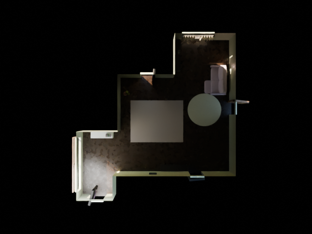
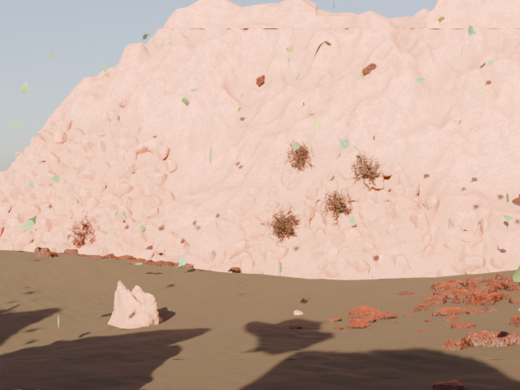

# Infinigen Asset Studio

A Blender interface for generating and customizing procedural assets and
environments using Infinigen.

This independent open-source add-on wraps **Infinigen 1.19.0**, developed by
Princeton Vision & Learning Lab. It is not the official Infinigen UI and is not
endorsed by Princeton. Infinigen remains an external engine; this repository
contains our interface, adapters, schemas, dependency manager and utilities.

## Screenshots

See [UI design](docs/ui_design.md) for the original sidebar walkthrough.
Actual managed-install output, seed 0 (temporary inspection fill light in this preview only):

Actual complete desert output, seed 0, using the native generated camera:

## Features

- Asset: discover 276 factory candidates; friendly verified Chair/Pan controls,
  seeds, overrides/locks, live Geometry Nodes, variations and favorites.
- Articulated assets: inspect native hinge/sliding/ball groups, move supported
  joints, reset and save poses without replacing procedural geometry.
- Room: native furnished Living Room, Bedroom, Kitchen, Dining Room, Bathroom
  or Random Interior. Wall height, small decoration solving and camera selection.
- World: discover upstream environment configs, run coarse + populate + fine
  terrain, quality presets and optional native tree-density/sun controls.
- First-run setup: detect existing environments or install a separate pinned
  managed copy, with logs, validation, repair and diagnostics.
- Cancellable background processes, scene JSON presets, generation history,
  output metadata and separate-window scene opening.
- Existing asset library, derived LOD/collision meshes and five Blender-dependent
  export formats retained.

## System requirements and compatibility

| Component | Supported / tested |
| --- | --- |
| Interactive host | Blender 4.2.0 tested; add-on declares minimum 4.2 |
| External worker | Python 3.11 and bpy **exactly 4.2.0** |
| Infinigen | 1.19.0, commit `01c39c7f7adcf7363ccbcc57c64410c69f4a4e7c` |
| Managed installer | Linux x86_64; Windows x86_64 through WSL2 |
| Other platforms | Validated existing environments; managed install not yet supported |

Windows users need an initialized WSL2 Linux distribution providing Python 3,
bash, g++ and make. Setup detects missing prerequisites and explains them. Native
Windows full terrain is unsupported in this upstream version. Asset Studio never
silently runs sudo, installs WSL, requires Administrator, or modifies Blender's
Python. See the pinned [upstream installation guide](https://github.com/princeton-vl/infinigen/blob/01c39c7f7adcf7363ccbcc57c64410c69f4a4e7c/docs/Installation.md).

Allow at least 8 GB free for installation and additional space for scene outputs.
Scene generation can consume substantial RAM; the native HelloWorld documentation
reports roughly 16 GB for its example. Hardware diagnostics report actual memory,
free disk and available worker Cycles devices rather than rejecting modest GPUs.

## Installation and quick start

1. Download `InfinigenAssetStudio-0.2.0.zip` from this project's GitHub Releases,
   or build it with `python scripts/build_release.py`.
2. In Blender 4.2 Preferences, use **Install from Disk** to install the ZIP and
   enable **Infinigen Asset Studio**. This is a legacy add-on ZIP, not an extension
   repository package. No upstream source is included in it.
3. Open the 3D View sidebar (**N**) and choose **Asset Studio**.
4. In **Setup & Diagnostics**, choose **Find Existing Installation** or
   **Install Infinigen Automatically**. Windows uses the selected WSL distribution.
5. Wait for source download, isolated Python/dependencies, CPU terrain compilation
   and validation. Progress and the complete job log are available in the panel.
6. Click **Discover assets & scene configs**, choose Asset, Room or World, set a
   seed and generate.

Existing installations are inspected without modification. Advanced inputs are
source folder, worker interpreter, backend and WSL distribution. **Validate & Use**
activates them only after health checks. A healthy untested version requires the
explicit **Use Anyway** checkbox; scene compatibility is still not guaranteed.

Managed configuration lives outside the add-on, so restart and add-on updates
preserve it. Windows uses `%LOCALAPPDATA%/InfinigenAssetStudio`; Linux uses
`~/.local/share/InfinigenAssetStudio`; macOS uses its Application Support folder.
WSL dependencies use the Linux distribution's own user data directory. Library,
logs, downloads and outputs survive managed dependency removal.

## Individual assets and articulation

Choose a generator and a seed, then **Generate / Update Preview**. Enable an
override before replacing a native sampled parameter. Locks preserve explicit
controls during randomization. Draft/Preview limit remaining subdivision;
Production keeps factory geometry. Variations remain as separate collections.

Generate an articulated Box or Cabinet, open **Articulation & Components**, select
an unlinked native joint and adjust its normalized position. Linked sockets stay
driven. Some node groups belong to inactive variants; the panel identifies this
limitation. Save a project/library entry to retain live geometry and saved edits.

## Indoor scenes

Room mode wraps the original indoor solver; it does not build substitute room
geometry. Five room types have native furniture constraints. The native floor plan
may contain other architecture; furniture solving is restricted to one selected
room type. Office and Hallway are not advertised as furnished presets.

Draft uses reduced native solver steps; Preview uses upstream fast_solve; Final
uses full solver defaults. Overhead uses the original overhead config; Interior
runs native camera search. Width/length, exact door/window counts and design styles
are not mapped controls in this release. Use native configs/overrides in Advanced
mode when you understand their effects.

## Nature scenes

The environment browser discovers actual scene_types gin files: forest, desert,
mountain, coast, river, plain, canyon, arctic and the other installed presets.
Draft maps to simple.gin, Preview to dev.gin and Final to high_quality_terrain.gin.
World runs coarse layout followed by asset population and fine terrain. Optional
tree density and sun elevation replace native bindings; their applicability depends
on the environment. Unsupported weather/fluid controls are not invented.

Scene progress uses actual native stage names and coarse milestones. It is not a
prediction of elapsed time. **Open Generated Scene** launches another Blender
process, preserving unsaved work in the current window. Native scene objects,
materials and cameras remain editable. Partial solver regeneration is unsupported.
Upstream scene seeds can have platform-dependent reproducibility limitations.

## Presets, history and outputs

Asset presets/projects remain compatible with 0.1.0. Room/World JSON presets record
mode, seed, settings, quality, exact configs/overrides and compatibility version.
Advanced mode provides a searchable discovered config browser and editable native
bindings through Blender's Text Editor. Dataset pipeline configs are inspectable;
scene generation uses the explicit supported task sequence rather than arbitrary
scheduler jobs.

Generation History supports regenerate, open output, open folder, favorite and
save that entry's JSON preset. Outputs are grouped under `outputs/assets`,
`outputs/rooms` and `outputs/worlds`; each successful scene has generation.json,
.blend, native pipeline logs and statistics. Seeds are prominent in all modes.

## Export and game preparation

Native .blend preserves procedural geometry, materials and articulation. Asset
exports support GLB, FBX, OBJ and USD when the host exposes those operators; they
use evaluated disposable copies and require acknowledgement of static-pose and
unbaked shader limitations. Asset collision and LOD are separate derived meshes.
Generated scene windows expose **Scene Export & Preparation**: save a native scene
copy or use host GLB/FBX/OBJ/USD exporters, inspect mesh statistics, pack resources,
and create LOD/collision copies for explicitly selected meshes. Applying selected
rotation/scale requires confirmation. Blender's native Save As / Export remains
available. Procedural shaders,
Geometry Nodes instances and articulation need format-specific baking/realization;
do not assume they survive every external format. Destructive preparation is not automatically applied to whole scenes.

## GPU notes

Auto and CPU are always offered. CUDA/OptiX choices appear only when the worker's
Cycles runtime reports devices. GPU availability applies to Cycles rendering and
saved render settings; it does not mean every generation operation uses CUDA.
Managed terrain is CPU compiled. GPU presence does not substitute for RAM.

## Troubleshooting and updates

- Setup failed: **View Last Log** loads it into Blender's Text Editor. Diagnose the
  reported stage; rerun setup for a failed owned install.
- Invalid source: choose the root with infinigen/__init__.py and pyproject.toml.
- Version mismatch: choose another install or install the recommended pinned copy.
- Missing dependency/native terrain: **Repair** a managed install. Existing
  environments remain the user's responsibility and are never silently changed.
- Slow scene: use Draft, inspect the native stage log, or Cancel. Output stages
  stay separate from current assets and no partial scene is imported.
- Copy Diagnostics includes versions, source commit, capabilities, devices, output
  path and last status. Share it deliberately because it includes local paths.
- Check Compatible Updates compares against this add-on's shipped manifest. It
  never follows main. Add-on updates and dependency replacement are separate.

## Development, releases and licensing

[Current audit](docs/CURRENT_ARCHITECTURE.md),
[dependency architecture](docs/DEPENDENCY_ARCHITECTURE.md),
[testing](docs/testing.md), [contributing](CONTRIBUTING.md).

GitHub Actions runs pure tests, validates package structure and builds a versioned
ZIP/checksum. Matching vX.Y.Z tags attach artifacts to a GitHub Release. This local
repository has no assumed remote URL; remote publication is a separate step.

Original add-on code is BSD-3-Clause; see [LICENSE](LICENSE).
[THIRD_PARTY_LICENSES.md](THIRD_PARTY_LICENSES.md) identifies Princeton's Infinigen
BSD license, the separate GPL submodule, Blender and managed dependencies.
Upstream notices stay in downloaded sources. Credits belong to the Infinigen
researchers, Blender contributors and the dependency authors.
